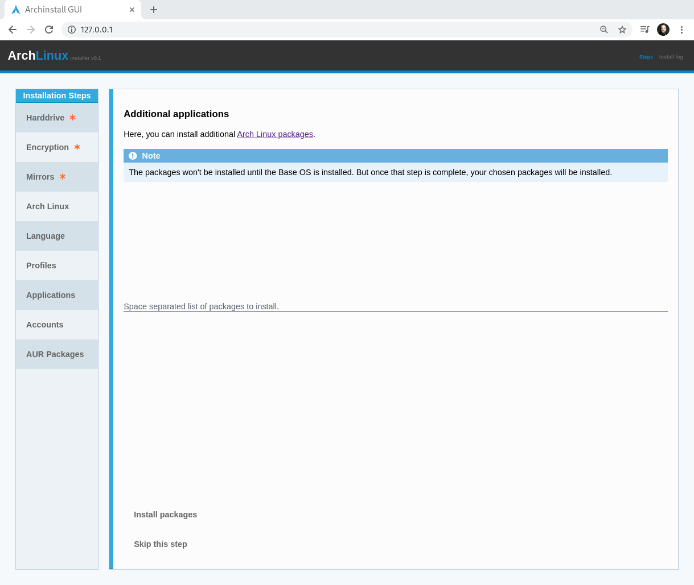

.. _applications:

Applications
============

| Applications lets you install additional packages from the `official package database <https://www.archlinux.org/packages/>`_.
| In the future there *might* be a search function here, but for now you have to search via the official page outside of the installation GUI.

.. note:: The packages will be queued for installation once the main Arch Linux OS is installed and the language has been configured.

