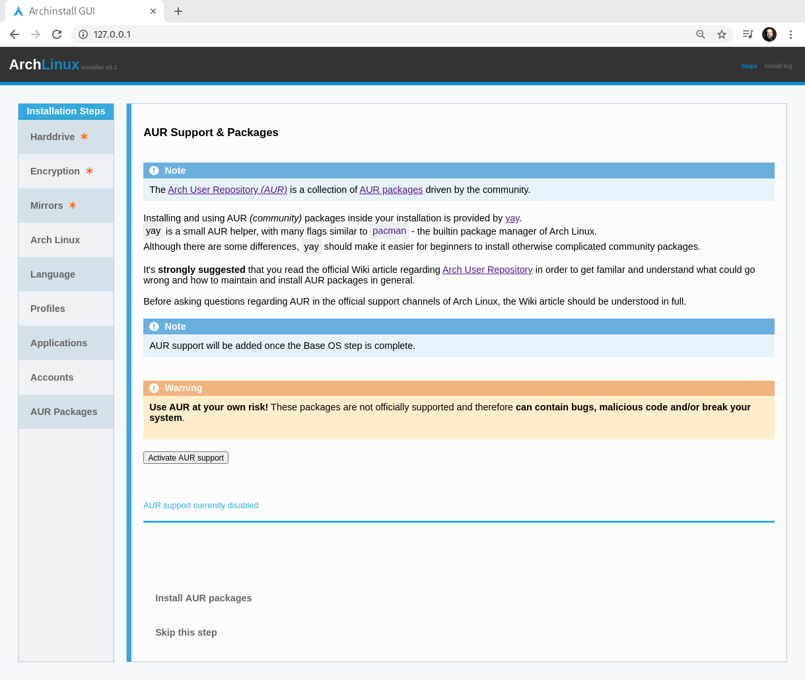

.. _aur_packages:

AUR Packages
============

| You have the option to enable AUR support, which will allow you to manage AUR packages just like you would manage normal Arch Linux packages.
| This is a bit **dangerous**, so proceed with caution or skip this step if you're unsure of what this is.

.. warning:: There are legitimiate risks with AUR, so do not use it unless you know what you're doing!

| After enabling AUR however, you have the same option as with packages, except that you can use any package from the `AUR pckage database <https://aur.archlinux.org/packages/>`_.
| After the successful installation, you can also use the tool `yay` to install packages inside the installation. A simple example would be:

.. code-block::

    yay -S spotify

Which would in theory install Spotify.

