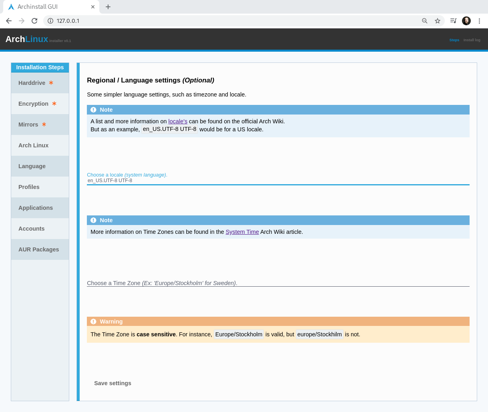

.. _language:

Language
========

| The language step selects which default `system encoding <>`_ to use, as well as which time zone you live in.

.. note:: This step will not configure the keyboard layout, as it's heavily depending on numerous factors. The default keyboard layout will be `en_US` and you can read more on the official `Wiki articles <>`_ on how to change it.

